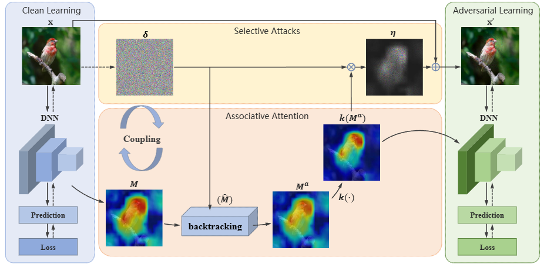

# Install
```
conda create -n aal-det python=3.8
conda activate aal-det
pip install torch==2.1.0 torchvision==0.16.0 torchaudio==2.1.0 --index-url https://download.pytorch.org/whl/cu118
pip install mmcv==2.1.0 -f https://download.openmmlab.com/mmcv/dist/cu118/torch2.1/index.html
cd aal-det
pip install -e . -v
```

# Dataset
For COCO dataset, you can just download official coco dataset and extract in ```data/coco```

For Single-frame InfraRed Small Target(SIRST) dataset, run
```shell
cd data
git clone https://github.com/YimianDai/open-sirst-v2.git
```

# TRAIN

```shell
python tools/train.py configs/aal/yolov3_aal_d53_coco.py
python tools/test.py configs/aal/yolov3_aal_d53_coco.py path/to/model.pth
```

# SIRST

||mAP(clean)|mAP(FGSM)|
|---|---|---|
|SSD-FGSM|0.224|0.233|
|SSD-AAL|0.192|0.225|
|Faster-RCNN-FGSM|0.595|0.595|
|Faster-RCNN-AAL|0.550|0.553|
|YOLOv3-FGSM|0.465|0.444|
|YOLOv3-AAL|0.503|0.505|
|Oscar-FGSM|||
|Oscar-AAL|||

# Implementation



We implemented multiple detection with CBAM module:
|name|file|used in|
|---|---|---|
|SSDNeckCBAM|AAL-Det/mmdet/models/necks/ssd_neck_cbam.py|SSD|
|FPNCBAM|AAL-Det/mmdet/models/necks/fpn_cbam.py|Faster-RCNN|
|YOLOV3NeckCBAM|AAL-Det/mmdet/models/necks/yolo_neck_cbam.py|YOLOv3|
|ChannelMapperCBAM|AAL-Det/mmdet/models/necks/channel_mapper_cbam.py|Detr|

Available training and testing config files:

**Detr**: ```AAL-Det/configs/aal/detr_aal_r50_coco.py```, ```AAL-Det/configs/aal/detr_aal_r50_sirst.py```

**Faster-RCNN**: ```AAL-Det/configs/aal/faster-rcnn_aal_r50_coco.py```, ```AAL-Det/configs/aal/faster-rcnn_aal_r50_sirst.py```

**SSD**： ```AAL-Det/configs/aal/ssdlite_aal_mobilenetv2-scratch_coco.py```, ```AAL-Det/configs/aal/ssdlite_aal_mobilenetv2-scratch_sirst.py```

**YOLOv3**: ```AAL-Det/configs/aal/yolov3_aal_d53_coco.py```, ```AAL-Det/configs/aal/yolov3_aal_d53_sirst.py```

The AAL training loops are implemented in ```AAL-Det/mmdet/engine/runner/loops_adv.py```.

NOTE: Although the complete AAL training requires backtracking process, we find that it unneccesary for detection models by experiments.